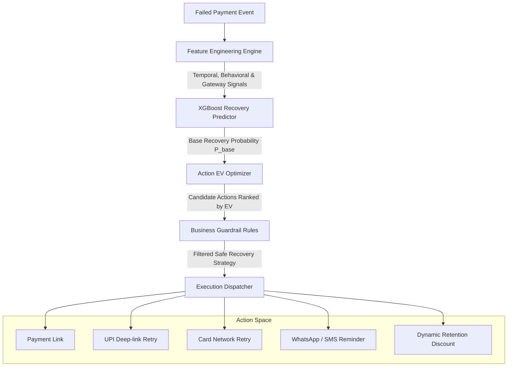

# RecoverPay

**ML-powered autonomous revenue recovery agent for payment failures.**

RecoverPay sits downstream of payment gateways (e.g., Razorpay, Stripe, Cashfree) to rescue failed transactions in real time. Rather than blindly hammering gateways with retries or spamming users with generic discounts, RecoverPay predicts transaction-level recovery probability, calculates expected monetary value across candidate actions, and applies deterministic business guardrails to execute the highest-ROI recovery strategy.

---

## Autonomous Decision Engine Architecture



---

## Model Performance & Efficiency

The core prediction model is built with **XGBoost (`binary:logistic`)** optimized for high-throughput, low-latency inference on tabular payment telemetry.

### Benchmark Metrics (Holdout Evaluation)

Evaluated on an 80/20 stratified split over **250,000 transactions**:

| Metric | Score | Operational Significance |
| :--- | :--- | :--- |
| **ROC-AUC** | **0.7208** | Strong discriminative ability between recoverable and non-recoverable payment drops. |
| **Recall** | **86.36%** | Captures ~86% of all salvageable transactions, minimizing silent revenue leakage. |
| **Precision** | **68.78%** | Prevents wasteful interventions or discount erosion on unrecoverable declines. |
| **F1-Score** | **0.7658** | Balanced harmonic performance on noisy payment distribution. |

### Inference Efficiency & Latency
- **Sub-10ms Inference**: Lightweight gradient-boosted tree structure enables real-time webhook handling without degrading checkout throughput.
- **Dimensionality Alignment**: Uses pre-compiled feature schema mapping (`feature_columns.json`) with zero-fill reindexing to handle unseen categorical levels safely.
- **Explainability (SHAP)**: Integrated with `shap.TreeExplainer` to provide top-$k$ feature contribution factors for audit trails and merchant dashboards.

### Feature Signals
- **Customer Affinity**: Customer Lifetime Value (LTV), tenure, repeat customer flags, and relative basket ratio (`amount / customer_ltv`).
- **Payment Reliability**: Historical customer success rates, cumulative failure count, payment method (UPI, card, netbanking, wallet).
- **Context & Temporal**: Hour of day (`is_peak_hour`), day of week (`is_weekend`), device type, and merchant category.
- **Gateway Feedback**: Failure reason code mapping (`bank_decline`, `insufficient_funds`, `network_timeout`, `auth_failed`).

---

## Decision Optimization & Economic Logic

The engine does not simply classify pass/fail; it optimizes for **Expected Monetary Value (EV)**:

$$\text{EV} = (P_{\text{base}} \times M_{\text{action}} \times \text{Amount}) - \text{Cost}_{\text{action}}$$

| Action | Cost (₹) | Success Multiplier ($M$) | Primary Use Case |
| :--- | :--- | :--- | :--- |
| `payment_link` | ₹0.00 | 0.92 | Interactive drop-off recovery across devices |
| `upi_retry` | ₹0.00 | 0.83 | Seamless UPI intent re-triggering |
| `card_retry` | ₹0.00 | 0.70 | Network decline re-submission |
| `reminder` | ₹2.00 | 0.45 | Passive SMS/WhatsApp notification |
| `discount_300` | ₹300.00 | 1.08 | High-basket, high-LTV cart abandonment intervention |

### Safety Guardrails
1. **Zero Retries on Insufficient Funds**: Never trigger automated UPI or card retries if the issuing bank reports non-sufficient funds.
2. **LTV Protection**: Dynamic discounts are locked unless customer LTV exceeds ₹5,000.
3. **Spam & Failure Velocity Throttle**: If 3 or more previous failures have occurred, restrict options strictly to passive reminders.
4. **Margin Safeguards**: Discounts are disallowed on transaction values under ₹500.

---

## Project Structure

```text
recoverpay/
├── backend/
│   ├── main.py                     # FastAPI server with prediction & recovery endpoints
│   └── services/
│       ├── predictor.py            # XGBoost loader & inference service
│       ├── optimizer.py            # Expected-value action scoring
│       └── guardrails.py           # Deterministic business rule engine
├── ml/
│   ├── generate_data.py            # Synthetic payment dataset generator (250k rows)
│   ├── features.py                 # Feature engineering & one-hot transformations
│   ├── train.py                    # XGBoost training pipeline & metrics exporter
│   └── explain.py                  # Global & local SHAP explainer
├── database/
│   └── schema.sql                  # PostgreSQL telemetry & event logging schema
├── data/
│   └── transactions.csv            # Training dataset (generated via setup)
├── models/
│   ├── recovery_model.joblib       # Serialized XGBoost model
│   ├── feature_columns.json        # Compiled input column vector
│   └── metrics.json                # Persisted validation benchmarks
├── setup.sh                        # One-click environment bootstrap & trainer
├── run.sh                          # Development server runner
├── requirements.txt                # Python dependencies
└── pyproject.toml                  # Project & type-checker configuration
```

---

## Quick Start (Automated Setup)

Run the automated setup script to configure the virtual environment, install dependencies, link packages, generate synthetic training data, and train the model:

```bash
./setup.sh
```

To force-regenerate synthetic data and retrain the model from scratch:
```bash
./setup.sh --force
```

Start the API development server:
```bash
./run.sh
```

Interactive API documentation (Swagger UI) is available at:
```text
http://127.0.0.1:8000/docs
```

---

## API Usage

### Recovery Prediction & Action Recommendation

**Request (`POST /predict/recovery`):**
```bash
curl -X POST http://127.0.0.1:8000/predict/recovery \
  -H "Content-Type: application/json" \
  -d '{
    "amount": 12500,
    "payment_method": "upi",
    "previous_success_rate": 0.92,
    "previous_failures": 1,
    "customer_ltv": 85000,
    "customer_tenure_days": 420,
    "transaction_count": 9,
    "hour": 20,
    "day_of_week": 4,
    "device_type": "mobile",
    "merchant_category": "fashion",
    "failure_reason": "bank_decline"
  }'
```

**Response:**
```json
{
  "recovery_probability": 0.59755,
  "recommended_action": {
    "action": "payment_link",
    "success_probability": 0.54975,
    "expected_recovery": 6871.82,
    "cost": 0.0,
    "expected_value": 6871.82
  },
  "candidate_actions": [ ... ],
  "explanations": [ ... ]
}
```
